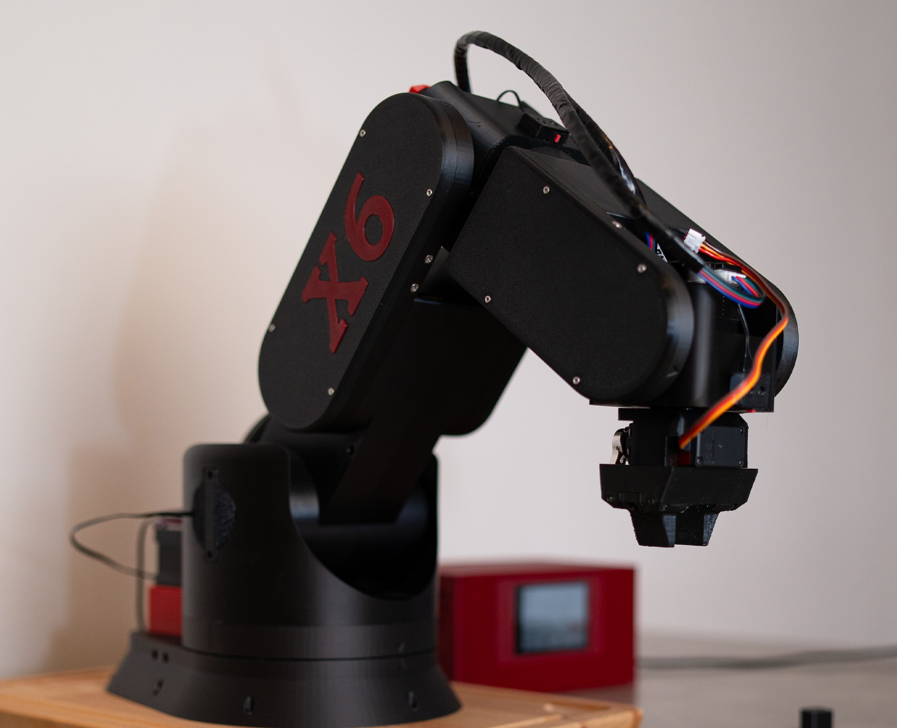
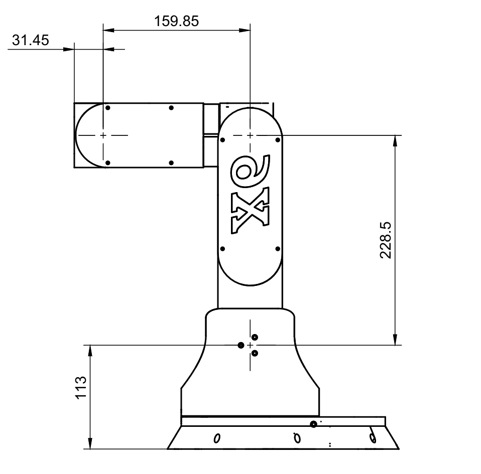

# X6 Robot Arm

The **X6** is an educational and hobbyist-oriented robot arm designed to provide precise, repeatable movement with a focus on learning and experimentation. 

## Key Features
- **Precision:** Achieves 0.05 mm repeatability.
- **Control Board:** Utilizes the **BTT Octopus Pro** with an **STM32H723** microcontroller.
- **GUI Interface:** Controlled via a custom **LVGL based GUI** for 

## Dimensions

## Current Status
- **GUI Description:** Available.
- **Hardware Description:** Available.
- **Code:** Coming soon.
- **STL Files and Build Guide:** Coming soon.

*Stay tuned for more updates!*
